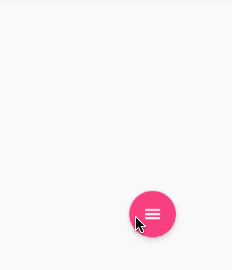

ConstraintLayout : demo, animation demo

## RecyclerView Parallex Effect
It's a magic of GuideLine. 

P.S. [Second Appraoch] 
It could also be done by a ImageView whose scaleType is matrix. 
As you scorll the RecyclerView, the matrix of that ImageView will move as well.


## Expand/Collapsed
Just use `ConstraintSet` to load two different layout xml, and apply one of them to the ContraintLayout in your Activity.

## Bouncing Fab

```java
final Guideline guideline = findViewById(R.id.guideline);
final int end = ((ConstraintLayout.LayoutParams)guideline.getLayoutParams()).guideEnd;

ValueAnimator anim = ValueANimator.ofInt(0, end);
anim.setDuration(2000);
anim.setInterpolator(new BounceInterpolator());

anim.addUpdateListener( animator -> {
      ConstraintLayout.LayoutParams lp = (ConstraintLayout.LayoutParams) guideline.getLayoutParams();
      lp.guideEnd = (integer) animator.getAnimatedValue();
      guideline.setLayoutParams(lp);
});

anim.start();

```

## ArcMenu

Thanks to the circle posionting feature in ConstraintLayout, making an ArcMenu would be super easy for us right now. 




## MotionLayout


**Reference** 
[https://www.youtube.com/watch?v=8lAXJ5NFXTM](https://www.youtube.com/watch?v=8lAXJ5NFXTM)

[https://github.com/ibhavikmakwana/Constraint-Layout-Animations](https://github.com/ibhavikmakwana/Constraint-Layout-Animations)

